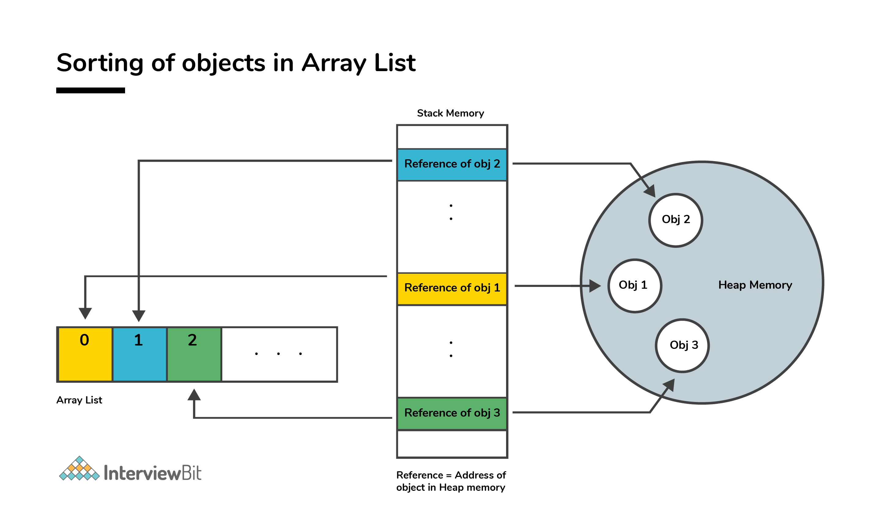
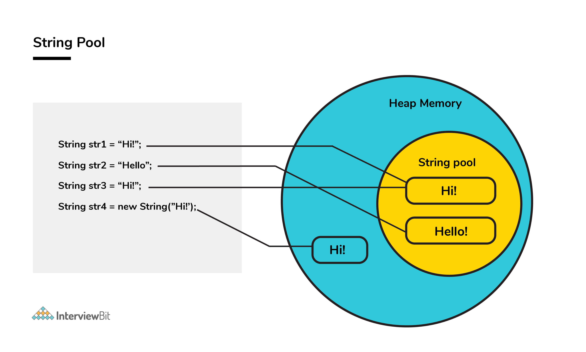
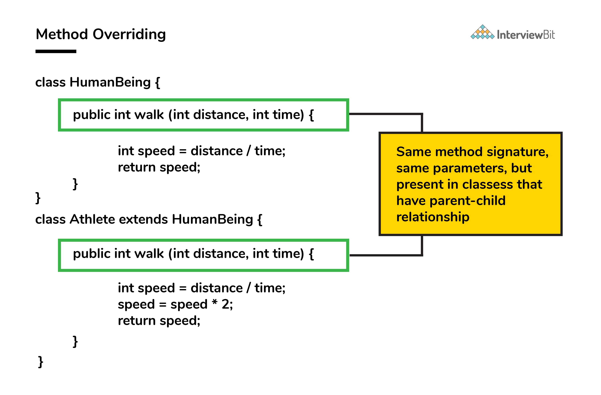
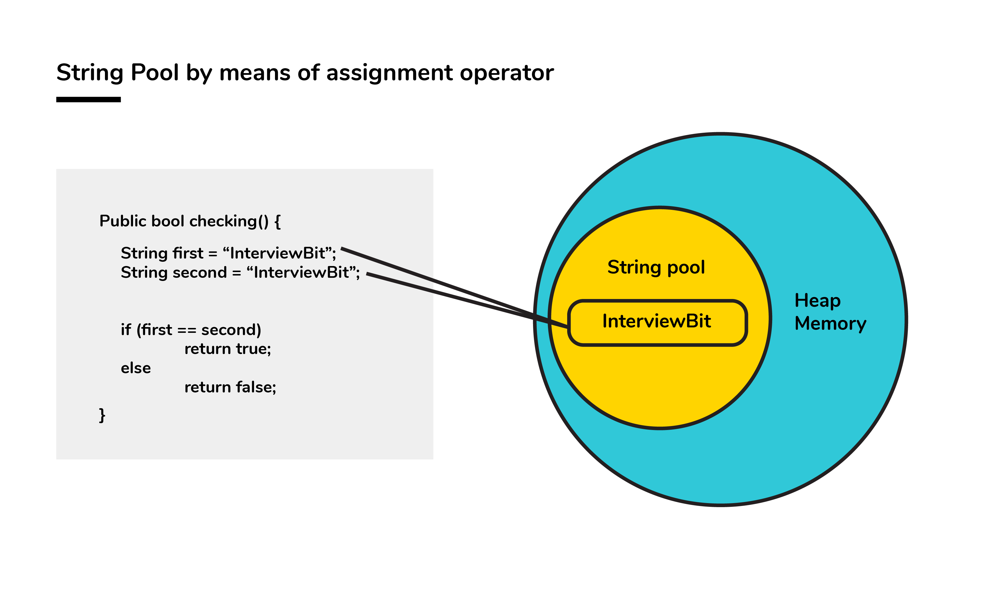
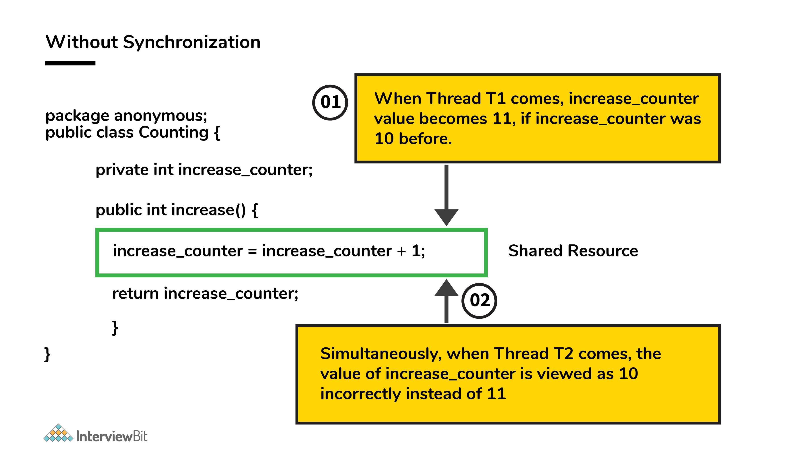
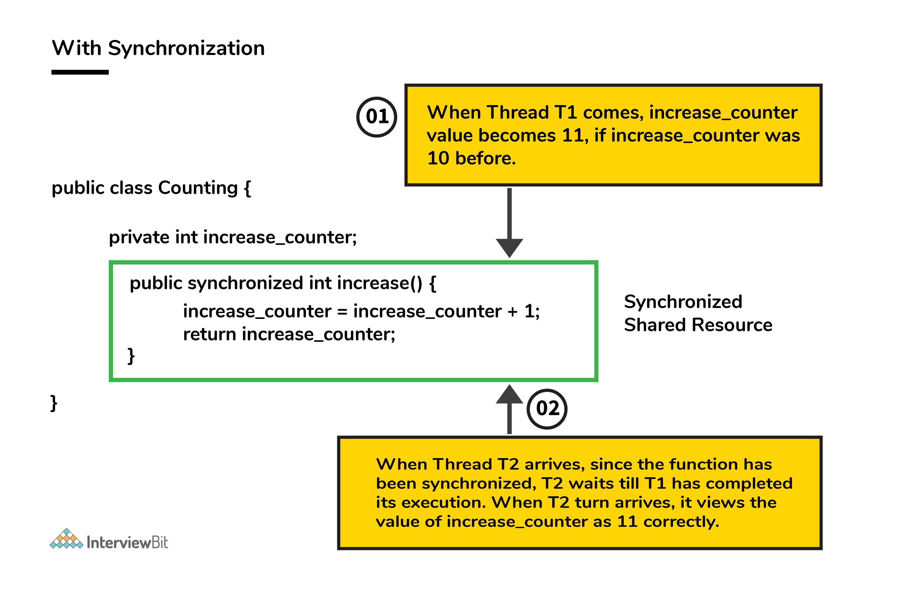

# Java Interview Questions

Do you have what it takes to ace a Java Interview? We are here to help you in consolidating your knowledge and concepts in Java. The following article will cover all the popular Java interview questions in depth.

Go through all the questions to enhance your chances of performing well in the interviews. The questions will revolve around the basic and core fundamentals of Java.

So, let’s dive deep into the plethora of useful interview questions on Java.

## 1. What do you understand by an instance variable and a local variable?

**Instance variables** are those variables that are accessible by all the methods in the class. They are declared outside the methods and inside the class. These variables describe the properties of an object and remain bound to it at any cost.

All the objects of the class will have their copy of the variables for utilization. If any modification is done on these variables, then only that instance will be impacted by it, and all other class instances continue to remain unaffected.

```java
class Athlete {
	public String athleteName;
	public double athleteSpeed;
	public int athleteAge;
}
```

**Local variables** are those variables present within a block, function, or a constructor and can be accessed only inside them. The utilization of the variable is restricted to the block scope. Whenever a local variable is declared inside a method, the other class methods don’t have any knowledge about the local variable.
```java
public void athlete() {
	String athleteName;
	double athleteSpeed;
	int athleteAge;
}
```


## 2. Contiguous memory locations are usually used for storing actual values in an array but not in `ArrayList`. Explain.

In the case of `ArrayList`, data storing in the form of primitive data types (like `int`, `float` etc.) is not possible. The data members/objects present in the ArrayList have references to the objects which are located at various sites in the memory. Thus, storing of actual objects or non-primitive data types (like `Integer`, `Double` etc.) takes place in various memory locations.



However, the same does not apply to the arrays. Object or primitive type values can be stored in arrays in contiguous memory locations, hence its every element does not require any reference to the next element.


## 3. Pointers are used in C/ C++. Why does Java not make use of pointers?

Pointers are quite complicated and unsafe to use by beginner programmers. Java focuses on code simplicity, and usage of pointers can make it challenging. Pointer utilization can also cause potential errors. Moreover, security is also compromised if pointers are used because the users can directly access memory with the help of pointers.

Thus, a certain level of abstraction is furnished by not including pointers in Java. Moreover, the usage of pointers can make the procedure of garbage collection quite slow and erroneous. Java makes use of references as these cannot be manipulated, unlike pointers.

## 4. Apart from the security aspect, what are the reasons behind making strings immutable in Java?

A String is made immutable due to the following reasons:

- **String Pool:** Designers of Java were aware of the fact that String data type is going to be majorly used by the programmers and developers. Thus, they wanted optimization from the beginning. They came up with the notion of using the String pool (a storage area in Java heap) to store the String literals.
    
    They intended to decrease the temporary String object with the help of sharing. Immutable class is needed to facilitate sharing. The sharing of the mutable structures between two unknown parties is not possible. Thus, immutable Java String helps in executing the concept of String Pool.
- **Multithreading:** Safety of threads regarding the String objects is an important aspect in Java. No external synchronization is required if the String objects are immutable. Thus, a cleaner code can be written for sharing the String objects across different threads. The complex process of concurrency is facilitated by this method.
- **Collections:** In case of Hashtables and HashMaps, keys are String objects. If the String objects are not immutable, then it can get modified during the period when it resides in the HashMaps. Consequently, the retrieval of the desired data is not possible. Such changing states pose a lot of risks. Therefore, it is quite safe to make the string immutable.

## 5. Although inheritance is a popular OOP concept, it is less advantageous than composition. Explain.

Inheritance lags behind composition in the following scenarios:

-  **Multiple-inheritance is not possible in Java**
Classes can only extend from one superclass. In cases where multiple functionalities are required, for example - to read and write information into the file, the pattern of composition is preferred. The writer, as well as reader functionalities, can be made use of by considering them as the private members.

- **Composition assists in attaining high flexibility and prevents breaking of encapsulation.**

- **Unit testing is possible with composition and not inheritance.**
When a developer wants to test a class composing a different class, then Mock Object can be created for signifying the composed class to facilitate testing.
This technique is not possible with the help of inheritance as the derived class cannot be tested without the help of the superclass in inheritance.

- **The loosely coupled nature of composition is preferable over the tightly coupled nature of inheritance.**
   Let’s take an example:
   ```java
   package comparison;
	   
	public class Top {
		public int start() {
			return 0;
		}
	}

	class Bottom extends Top {
		public int stop() {
		return 0;
		}
	}
	```
	In the above example, inheritance is followed.
	Now, some modifications are done to the Top class like this:
	```java
	public class Top {
		public int start() {
			return 0;
		}
		public void stop() {
		}
	}
	```
	If the new implementation of the Top class is followed, a **compile-time** error is bound to occur in the Bottom class. Incompatible return type is there for the `Top.stop()` function. Changes have to be made to either the Top or the Bottom class to ensure compatibility.
However, the composition technique can be utilized to solve the given problem:
	```java
	class Bottom {
		Top par = new Top();
		
		public int stop() {
			par.start();
			par.stop();
			return 0;
		}
	}
	```

## 6. Briefly explain the concept of constructor overloading.

Constructor overloading is the process of creating multiple constructors in the class consisting of the same name with a difference in the constructor parameters. Depending upon the number of parameters and their corresponding types, distinguishing of the different types of constructors is done by the compiler.
```java
class Hospital {
	int variable1, variable2;
	double variable3;
	
	public Hospital(int doctors, int nurses) {
		variable1 = doctors;
		variable2 = nurses;
	}
	
	public Hospital(int doctors) {
		variable1 = doctors;
	}
	
	public Hospital(double salaries) {
		variable3 = salaries
	}
}
```
Three constructors are defined here but they differ on the basis of parameters type and their numbers.

## 7. Comment on method overloading and overriding by citing relevant examples.

In Java, **method overloading** is made possible by introducing different methods in the same class consisting of the same name. Still, all the functions differ in the number or type of parameters. It takes place inside a class and enhances program readability.

Only difference in the return type of the method does not promote method overloading. The following example will furnish you with a clear picture of it.

Both the functions have the same name but differ in the number of arguments. The first method calculates the area of the rectangle, whereas the second method calculates the area of a cuboid.

**Method overriding** is the concept in which two methods having the same method signature are present in two different classes in which an inheritance relationship is present. A particular method implementation (already present in the base class) is possible for the derived class by using method overriding.
Let’s give a look at this example:

Both class methods have the name walk and the same parameters, distance and time. If the derived class method is called, then the base class method walk gets overridden by that of the derived class.

Note that the `@Override` annotation is optional, but is considered a good coding practice. 

## 8. How would you differentiate between a String, StringBuffer, and a StringBuilder?

1. **Storage area:** In string, the String pool serves as the storage area. For StringBuilder and StringBuffer, heap memory is the storage area.
2. **Mutability:** A String is immutable, whereas both the StringBuilder and StringBuffer are mutable.
4. **Efficiency:** It is quite slow to work with a String. However, StringBuilder is the fastest in performing operations. The speed of a StringBuffer is more than a String and less than a StringBuilder. (For example appending a character is fastest in StringBuilder and very slow in String because a new memory is required for the new String with appended character.)
5. **Thread-safe:**  In the case of a threaded environment, StringBuilder and StringBuffer are used whereas a String is not used. However, StringBuilder is suitable for an environment with a single thread, and a StringBuffer is suitable for multiple threads.

**Syntax:**
```java
// String
String first = "InterviewBit";
String second = new String("InterviewBit");
// StringBuffer
StringBuffer third = new StringBuffer("InterviewBit");
// StringBuilder
StringBuilder fourth = new StringBuilder("InterviewBit");
```

## 9. Using relevant properties highlight the differences between interfaces and abstract classes.

1. **Availability of methods:** Only abstract methods are available in interfaces, whereas non-abstract methods can be present along with abstract methods in abstract classes.
2. **Variable types:** Static and final variables can only be declared in case of interfaces, whereas abstract classes can also have non-static and non-final variables.
3. **Inheritance:** Multiple inheritance is facilitated by interfaces, whereas abstract classes do not promote multiple inheritances.
4. **Data member accessibility:** By default, the class data members of interfaces are of the public- type. Conversely, the class members for an abstract class can be protected or private also.
5. **Implementation:** With the help of an abstract class, the implementation of an interface is easily possible.
    However, the converse is not true;
    Abstract class:
    ```java
	public abstract class Athlete {
		public abstract void walk();
	}
	```
	Interface:
	```java
	public interface Walkable {
		void walk();
	}
	```
## 10. How is the creation of a String using `new()` different from that of a literal?
When a String is formed as a literal with the assistance of an assignment operator, it makes its way into the String constant pool so that [String Interning](https://en.wikipedia.org/wiki/String_interning) can take place. This same object in the heap will be referenced by a different String if the content is the same for both of them.

```java
public bool checking() {
	String first = "InterviewBit";
	String second = "InterviewBit";
	if (first == second)
		return true;
	else
		return false;
}
```
The `checking()` function will return true as the same content is referenced by both the variables.

Conversely, when a String formation takes place by the help of a `new()` operator, interning does not take place. The object gets created in the heap memory even if the same content object is present.
```java
public bool checking() {
	String first = new String("InterviewBit");
	String second = new String("InterviewBit");
	if (first == second)
		return true;
	else
		return false;
}
```

The `checking()` function will return false as the same content is not referenced by both the variables.


## 11. In Java, static as well as private method overriding is possible. Comment on the statement.

The statement in the context is completely False. The static methods have no relevance with the objects, and these methods are of the class level. In the case of a child class, a static method with a method signature exactly like that of the parent class can exist without even throwing any compilation error.

The phenomenon mentioned here is popularly known as method hiding, and overriding is certainly not possible. Private method overriding is unimaginable because the visibility of the private method is restricted to the parent class only. As a result, only hiding can be facilitated and not overriding.

## 12. A single `try` block and multiple `catch` blocks can co-exist in a Java Program. Explain.

Yes, multiple catch blocks can exist but specific approaches should come prior to the general approach because only the first catch block satisfying the catch condition is executed.
The given code illustrates the same:
```java
public class MultipleCatch {
	public static void main(String args[]) {
		try {
			int n = 1000, x = 0;
			int arr[] = new int[n];
			for (int i = 0; i <= n; i++) {
				arr[i] = i / x;
			}
		} catch (ArrayIndexOutOfBoundsException exception) {
			System.out.println("1st block = ArrayIndexOutOfBoundsException");
		} catch (ArithmeticException exception) {
			System.out.println("2nd block = ArithmeticException");
		} catch (Exception exception) {
			System.out.println("3rd block = Exception");
		}
	}
}
```
Here, the second catch block will be executed because of division by `0` (`i / x`). Incase `x` was greater than `0` then the first catch block will execute because for loop runs till `i = n` and array index are till `n-1`.

## 13. Do `final`, `finally` and `finalize` keywords have the same function?
All three keywords have their own utility while programming.

**Final**
If any restriction is required for classes, variables, or methods, the final keyword comes in handy. Inheritance of a final class and overriding of a final method is restricted by the use of the final keyword. The variable value becomes fixed after incorporating the final keyword.
Example:
```java
	final int a=100;
	a = 0;  // error
```
The second statement will throw an error.

**Finally**
It is the block present in a program where all the codes written inside it get executed irrespective of handling of exceptions.
Example:
```java
try {
	int variable = 5;
} catch (Exception exception) {
	System.out.println("Exception occurred");
} finally {
	System.out.println("Execution of finally block");
}
```


**Finalize**
Prior to the garbage collection of an object, the finalize method is called so that the clean-up activity is implemented.
Example:
```java
public static void main(String[] args) {
	String example = new String("InterviewBit");
	example = null;
	System.gc(); // Garbage collector called
}
public void finalize() {
	// Finalize called
}
```

## 14. Is exceeding the memory limit possible in a program despite having a garbage collector?
Yes, it is possible for the program to go out of memory in spite of the presence of a garbage collector. Garbage collection assists in recognizing and eliminating those objects which are not required in the program anymore, in order to free up the resources used by them.

In a program, if an object is unreachable, then the execution of garbage collection takes place with respect to that object. If the amount of memory required for creating a new object is not sufficient, then memory is released for those objects which are no longer in the scope with the help of a garbage collector. The memory limit is exceeded for the program when the memory released is not enough for creating new objects.

Moreover, exhaustion of the heap memory takes place if objects are created in such a manner that they remain in the scope and consume memory. The developer should make sure to dereference the object after its work is accomplished. Although the garbage collector endeavours its level best to reclaim memory as much as possible, memory limits can still be exceeded.

Let’s take a look at the following example:
```java
List<String> example = new LinkedList<String>();
while(true){
	example.add(new String("Memory Limit Exceeded"));
}
```

## 15. What makes a `HashSet` different from a `TreeSet`?
Although both HashSet and TreeSet are not synchronized and ensure that duplicates are not present, there are certain properties that distinguish a HashSet from a TreeSet.
1. **Implementation:** For a HashSet, the hash table is utilized for storing the elements in an unordered manner. However, TreeSet makes use of the red-black tree to store the elements in a sorted manner.
2. **Complexity/ Performance:** For adding, retrieving, and deleting elements, the time amortized complexity is $\mathcal O(1)$ for a HashSet. The time complexity for performing the same operations is a bit higher for TreeSet and is equal to $\mathcal O(\log n)$. Overall, the performance of HashSet is faster in comparison to TreeSet.
3. **Methods:** `hashCode()` and `equals()` are the methods utilized by HashSet for making comparisons between the objects. Conversely, `compareTo()` and `compare()` methods are utilized by TreeSet to facilitate object comparisons.
4. **Objects type:** Heterogeneous and null objects can be stored with the help of HashSet. In the case of a TreeSet, runtime exception occurs while inserting heterogeneous objects or null objects.

## 16. Why is the character array preferred over string for storing confidential information?
In Java, a string is basically immutable i.e. it cannot be modified. After its declaration, it continues to stay in the string pool as long as it is not removed in the form of garbage. In other words, a string resides in the heap section of the memory for an unregulated and unspecified time interval after string value processing is executed.

As a result, vital information can be stolen for pursuing harmful activities by hackers if a memory dump is illegally accessed by them. Such risks can be eliminated by using mutable objects or structures like character arrays for storing any variable. After the work of the character array variable is done, the variable can be configured to blank at the same instant. Consequently, it helps in saving heap memory and also gives no chance to the hackers to extract vital data.

## 17. Why is synchronization necessary? Explain with the help of a relevant example.
Concurrent execution of different processes is made possible by synchronization. When a particular resource is shared between many threads, situations may arise in which multiple threads require the same shared resource.

Synchronization assists in resolving the issue and the resource is shared by a single thread at a time. Let’s take an example to understand it more clearly. For example, you have a URL and you have to find out the number of requests made to it. Two simultaneous requests can make the count erratic.



If a thread Thread1 views the count as `10`, it will be increased by `1` to `11`. Simultaneously, if another thread Thread2 views the count as `10`, it will be increased by `1` to `11`. Thus, inconsistency in count values takes place because expected final value is `12` but actual final value we get will be `11`.

Now, the function `increase()` is made synchronized so that simultaneous accessing cannot take place.



If a thread Thread1 views the count as `10`, it will be increased by `1` to `11`, then the thread Thread2 will view the count as `11`, it will be increased by `1` to `12`. Thus, consistency in count values takes place.